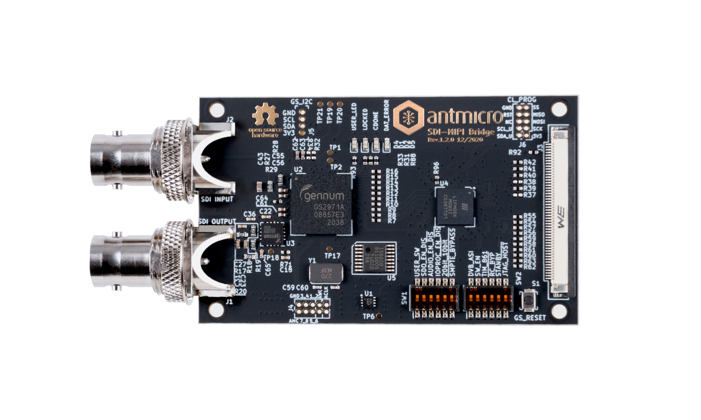
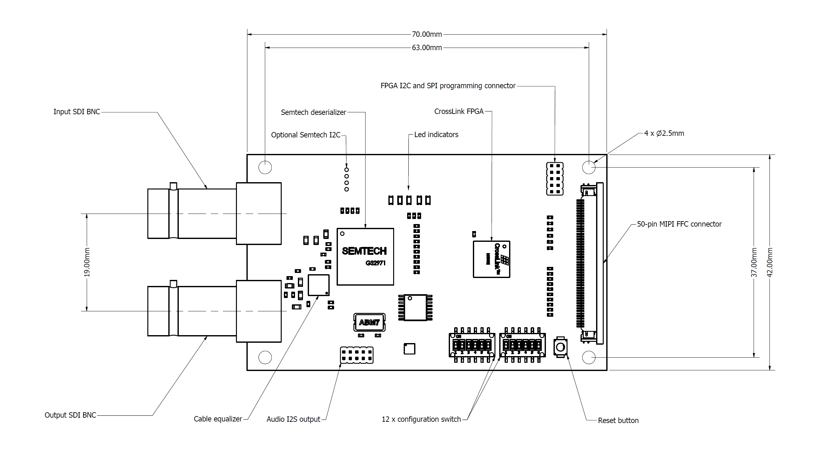

========================
SDI to MIPI CSI-2 bridge
========================

Copyright (c) 2020-2021 `Antmicro <https://www.antmicro.com>`_

Overview
========

This repository contains open hardware KiCad design files for Antmicro's SDI to MIPI CSI-2 bridge.
This device enables connecting industrial and filmmaking cameras and video accessories to edge AI platforms which often include the MIPI CSI-2 interface.

The board includes an SDI input BNC connector and Antmicro's standard 50-pin FFC output connector (compatible with a range of our open hardware boards) exposing MIPI CSI-2 lanes as well as an I2C bus for configuration.

An additional SDI output (loopback) BNC connector is also available.

SDI signal conversion is implemented with a `Semtech GS2971A <https://www.semtech.com/products/broadcast-video/receivers-deserializers/gs2971a>`_ deserializer which passes the parrallel 10-bit video data to the `Lattice CrossLink LIF-MD6000-6KMG80I <http://www.latticesemi.com/en/Products/FPGAandCPLD/CrossLink>`_.
The CrossLink FPGA includes programmable logic and dedicated MIPI D-PHY transceivers.
It can be configured to accept parallel video data from the deserializer and transmit it over MIPI CSI-2 to the host platform.
SPI and I2C programming interfaces are exposed so the deserializer and the CrossLink FPGA can be configured from the host platform.
Additionally, a set of DIP switches allows the user to easily pre-set the mode of operation of the deserializer.

Repository structure
--------------------

The main repository directory contains KiCad PCB project files, a LICENSE and README.
The remaining files are stored in the following directories:

* ``3d-model`` - contains a `mechanical model <3d-model/sdi-mipi-bridge.stl>`_ of the board in stl mesh format
* ``lib`` - contains the component libraries
* ``doc`` - contains selected files for device fabrication (schematic in PDF, BoM)
* ``img`` - contains graphics for this README

Key Features
============

* Implements Single Link (3G-SDI) video conversion
* Supports SMPTE ST 425 (Level A and Level B), SMPTE ST 424, SMPTE ST 292, SMPTE ST 259-C and DVB-ASI as defined by the Semtec GS2971A specification
* Integrated loopback BNC connector for easy daisy-chaining with multiple SDI video accessories
* Audio de-embedder for 8 channels of 48kHz audio exposed on I2S 10 pin header
* Two 4-lane MIPI CSI-2 interfaces with up to 6 Gbps, each exposed on the 50 pin FFC connector.
* I2C configuration interface to handle CrossLink FPGA and SDI deserializer
* SPI interface for CrossLink configuration
* 12x DIP switches to initially configure the deserializer
* 2 LED indicators for user purposes

Board dimensions
================

Getting started
===============

The SDI-MIPI PCB can be manufactured and assembled from the provided design files.

The board can also be purchased preassembled from our partner `Capable Robot Components <https://capablerobot.com/products/sdi-mipi-bridge/>`_.

If you want to manufacture the board yourself, it is recommended to pick PCB manufacturing technology which guarantees impedance matching of the SDI and CSI high speed data lanes.
The board is powered with 3.3V DC through the 50-pin FFC host connector.
It is recommended to provide at least 1A of power supply.

The PCB includes 12 configuration DIP switches to pre-set the initial mode of operation.
Typical switch configuration for a 10-bit multiplexed 3G DDR FORMAT is:

*  20BIT/10BIT - LOW
*  RATE_SEL0  - LOW
*  RATE_SEL1  -  HIGH
*  SMPTE_BYPASS   -  HIGH
*  DVB-ASI  -  LOW

Please refer to the `GS2971A datasheet <https://semtech.my.salesforce.com/sfc/p/#E0000000JelG/a/44000000MD3i/kpmMkrmUWgHlbCOwdLzVohMm1SDPoVH85guEGK.KXTc>`_ for more configuration options.

Supported platforms
===================

The SDI-MIPI bridge is electrically compatible a range of processing platforms designed by Antmicro.
Most of them, such as the NVIDIA `Jetson Nano/Jetson Xavier NX baseboard <https://github.com/antmicro/jetson-nano-baseboard>`_ or the `TX2 Deep Learning Platform <https://github.com/antmicro/jetson-tx2-deep-learning-platform>`_ are available as OSHW designs.

Software support
================

Adapting NVIDIA's Linux4Tegra BSP to support the SDI bridge board is described `in a dedicated tutorial <sw_setup_l4t.rst>`_.
There is also `a tutorial <sw_setup_rpi.rst>`_ detailing the setup of the SDI bridge with the Raspberry Pi CM4 module.
If you need help to make the board work with other edge AI platforms or integrate the SDI interface into your own, dedicated device, Antmicro offers custom hardware and software engineering services - please reach out at contact@antmicro.com and let us know about your requirements.

License
=======

`Apache-2.0 <LICENSE>`_
