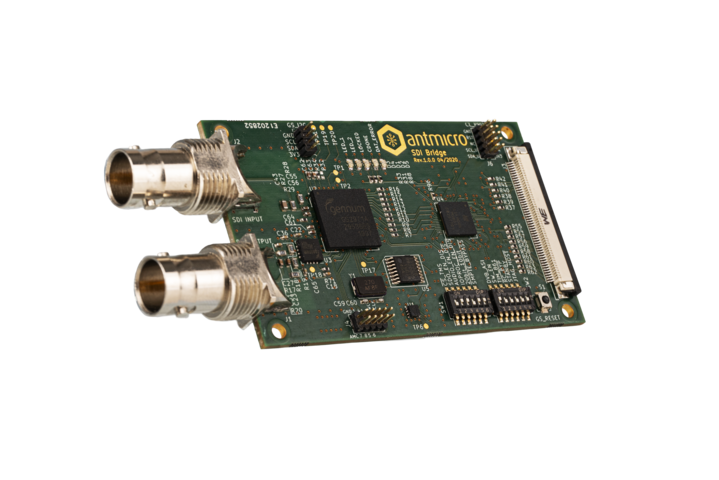

==========
SDI bridge
==========
Copyright (c) 2020 Antmicro <`www.antmicro.com <https://www.antmicro.com>`_>

Introduction
============

This repository contains design files for SDI to MIPI CSI-2 bridging device created by `Antmicro <https://antmicro.com/>`_.
This device enables to connect industrial and broadcast cameras to the devices with digital signal processors that are operating with MIPI CSI-2 signal standard.
The design was created in `KiCad EDA <https://kicad-pcb.org/>`_ and it is Open Source Hardware (OSHW).

Board overview
==============

The board is equipped with input BNC connector and output 50-pin MIPI CSI-2 connector. Additional SDI loopback BNC connector also has been provided. SDI signal conversion is implemented with a `Semtech GS2971A <https://www.semtech.com/products/broadcast-video/receivers-deserializers/gs2971a>`_ deserializer which is passing the parrallel 10-bit signal to the `CrossLink LIF-MD6000-6KMG80I <http://www.latticesemi.com/en/Products/FPGAandCPLD/CrossLink>`_. The CrossLink is video bridging and processing optimized FPGA with MIPI D-PHY bridging capabilities and it converts parallel signal to the output MIPI CSI-2 format. There are SPI and I2C programming interfaces and audio I2S output connector. Configuration DIP switches has been implemented to make this device more comprehensive platform for signal processing.

Repository structure
====================

The main repository directory contains the KiCad PCB project files, the Outjob file, LICENSE and README.
The remaining files are stored in the following directories:

* ``lib`` - contains the component libraries and 3D model of each component
* ``doc`` - contains selected files for device fabrication (schematic in PDF, BoM)
* ``img`` - contains graphics for this README

Key Features
============

* Operation at 2.97Gb/s, 2.97/1.001Gb/s, 1.485Gb/s, 1.485/1.001Gb/s and 270Mb/s
* Supports SMPTE ST 425 (Level A and Level B), SMPTE ST 424, SMPTE ST 292, SMPTE ST 259-C and DVB-ASI
* Integrated adaptive cable equalizer and output loopback BNC connector
* Audio de-embedder for 8 channels of 48kHz audio exposed on I2S 10 pin header
* Two 4-lane MIPI D-PHY transceivers up to 6 Gbps per PHY exposed at 50 pin FFC connector
* I2C programming and communication interface to CrossLink and Semtech deserializer
* SPI programming interface to program CrossLink
* 12x DIP switches Semtech configuration pins
* 2 LED indicators for user purposes

Board dimensions
================

.. figure:: img/SDI_dimensions.png   

Getting started
===============

The board is powered by a 3.3V DC through programming connectors or 50-pin host connector.
It is recommended to use at least 1A power supply. To make sure the board run properly, use reset button after turning the device on.
On board deserializer - Semtech GS2971A - offers many different operating modes. Included in design 12x configuration DIP switches, which are available to the user, allow to easily configure the device without using additional programming tools.

Recomended configuration (10-bit multiplexed 3G DDR FORMAT):

*  20BIT/10BIT - LOW
*  RATE_SEL0  - LOW
*  RATE_SEL1  -  HIGH
*  SMPTE_BYPASS   -  HIGH
*  DVB-ASI  -  LOW

To configure deserializer with specific operating mode, please refer to the `GS2971A datasheet <https://semtech.my.salesforce.com/sfc/p/#E0000000JelG/a/44000000MD3i/kpmMkrmUWgHlbCOwdLzVohMm1SDPoVH85guEGK.KXTc>`_

``Note:``

This revision of the device has only 10 parallel data lines, so the only 10bit modes are available. For more detailed information, please refer to the design files.
